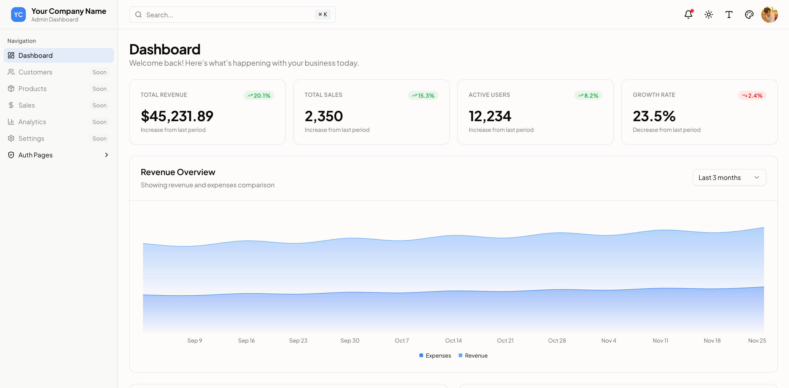
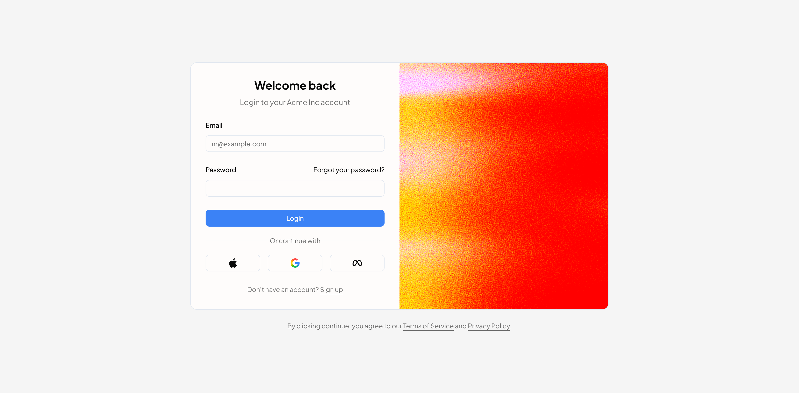

# Million Dollar Dashboard



Admin Dashboard UI built with Next.js and shadcn/ui. Designed with responsiveness and modern aesthetics in mind.

A clean, professional dashboard template I built for personal projects. Features a monochromatic color scheme inspired by modern admin interfaces, with multiple authentication layouts and a fully responsive design. While leveraging shadcn/ui components, I've added custom dashboard components and layouts optimized for real-world use.



> This is a template project ready to be customized for your needs.

## Run Locally

Clone the project

```bash
git clone https://github.com/yourusername/million-dollar-dashboard.git
```

Go to the project directory

```bash
cd million-dollar-dashboard
```

Install dependencies

```bash
npm install
```

Start the development server

```bash
npm run dev
```

Open [http://localhost:3000](http://localhost:3000) in your browser.

## License

Licensed under the [MIT License](https://choosealicense.com/licenses/mit/)
